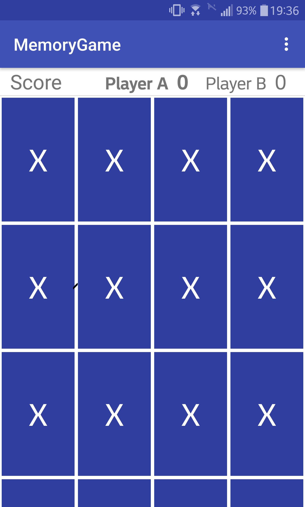
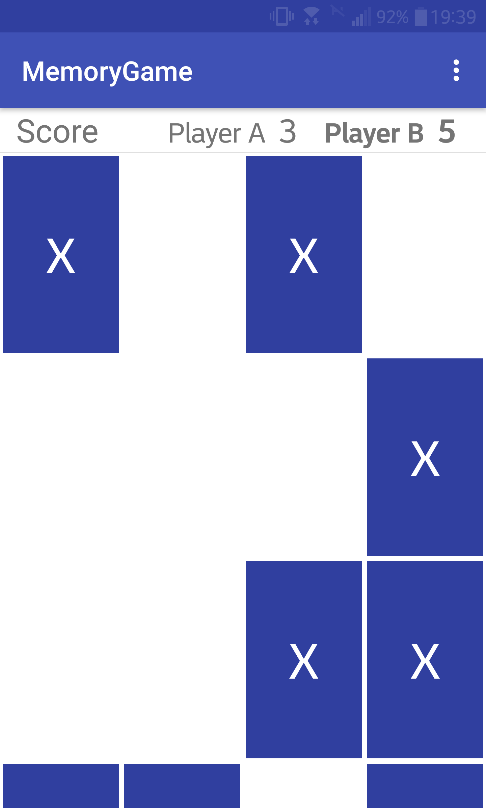
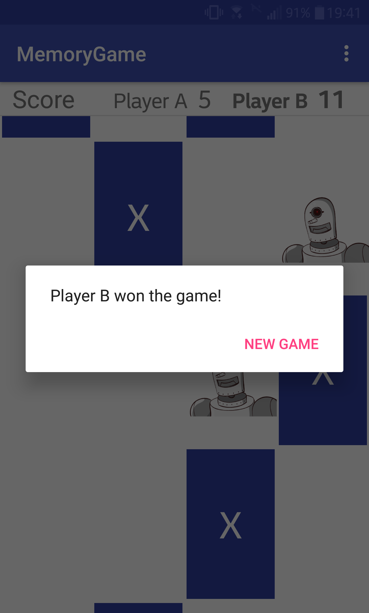

# MemoryGame
Android app that implements a card-matching memory game. Written in Java.

Uses the library "Android Flip 3D View Animation and Transition for Android" (https://github.com/genzeb/flip) to animate the flip of the cards.

# Screenshots

1. Starting game with no matches

2. Some matches have been made

3. Message is displayed when user wins

For more screenshots, check the screenshots folder
